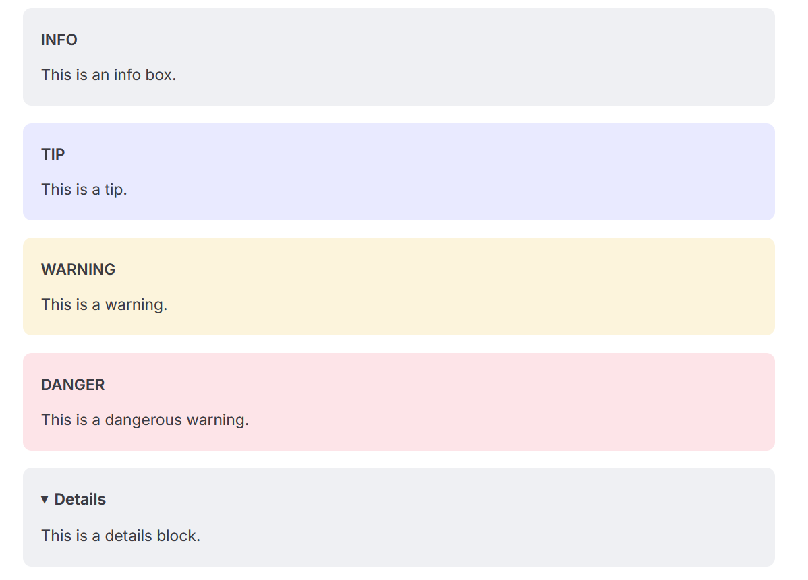

# 贡献指南

## 📝 文章核心要求
1. **内容相关性**：聚焦电教委员工作场景，包括设备操作、故障排查、软件技巧、经验分享等实用内容。
2. **原创与授权**：原创内容优先，转载需提供原作者明确授权证明，并注明来源、作者及授权信息。
3. **准确性**：技术类内容需标注适用设备型号/软件版本，经验类内容需基于真实工作场景。
4. **合规性**：需符合 [CC BY-NC-SA 4.0 许可](https://creativecommons.org/licenses/by-nc-sa/4.0/)，无侵权、违法及不当内容。
5. **简洁性**：内容尽量简洁准确，避免过多重复和废话。

## 📋 格式规范
### 1. 文章结构
- **标题**：简洁明了，设为一级标题（`#`）
- **分级**：用于确定文章难度，分为基础、进阶、高级三级，格式：
   ```
   <Badge type="tip" text="你想分的等级" />
   ```
- **前言（可选）**：简要说明内容价值，如“本文将分享教室音响杂音消除的实操步骤，适用于多数主流设备”，建议放在引用快中（`>`）
- **正文**：使用分级标题（`##` 二级、`###` 三级），技术步骤用有序列表，并列信息用无序列表。
- **结语（可选）**：补充注意事项或适用范围，如“此方法暂不适用于老旧型号XX投影仪”。

### 2. Markdown 基础要求
- 以一级标题（`#`）开头 **（必须）**，且仅能有**一个**一级标题
- 代码块用 `` ` `` 包裹，整行代码用三个 `` ` `` 包裹，并标注语言
- 加粗信息用 ``*`` 包裹，引用内容用 `>` 开头
- 链接格式：`[alt](url)`，请确保链接可访问且安全
- 注意多行文本或图片间空行
- 详细 Markdown 语法请阅读[Markdown 教程](https://markdown.com.cn/basic-syntax/)。
- 一些vitepress专有的markdown拓展：
   -添加Tip，Important等符号：
   ```::: info
      This is an info box.
      :::

      ::: tip
      This is a tip.
      :::

      ::: warning
      This is a warning.
      :::

      ::: danger
      This is a dangerous warning.
      :::

      ::: details
      This is a details block.
      :::
   ```
   效果：

### 3. 图片存储与引用规则
- **存储路径**：为了使文档文件有序，**强烈建议**所有图片放在 `docs/public/images/[文章英文简称]` 文件夹。
- **命名规则**：图片文件名建议使用英文简称或数字序号。
- **引用格式**：在文章中按此格式插入图片，确保路径正确：
  ```markdown
  
  ```

## 📤 提交方式
### 方式1：直接提交 PR（Pull Request）
1. **Fork 仓库**：访问 [CN-e-learning 仓库](https://github.com/CN-E-Learning/CN-e-learning)，点击右上角「Fork」复刻到个人仓库。
2. **在线修改或本地修改**
   > 根据目前的项目规划，同学们**仅可以**在 `/docs/faq` 中贡献内容。如果您认为 `/docs/guide` 中的文件需要修改请提交 [Issue](https://github.com/CN-E-Learning/CN-e-learning/issues) 等待处理。

3. **提交 PR**：
   - 提交在线/本地修改并推送至个人仓库。
   - 进入个人仓库页面，点击「Compare & pull request」，填写 PR 标题和简要说明并提交。

### 方式2：提交 Issue
1. **选择模板**：访问仓库「Issues」页面，点击「New issue」，选择「内容贡献」模板。
2. **填写信息**：请按照模板要求进行填写。


## 🔍 审核要点
1. 文章结构是否符合规范，Markdown 格式是否正确。
2. 图片是否放入指定文件夹，路径引用是否无误。
3. 内容是否满足相关性、准确性要求，无版权问题。
4. PR/Issue 信息是否完整，便于维护者快速审核整合。

审核通过后，您的贡献将被合并至主仓库，且会在「贡献者」列表展示您的信息。
